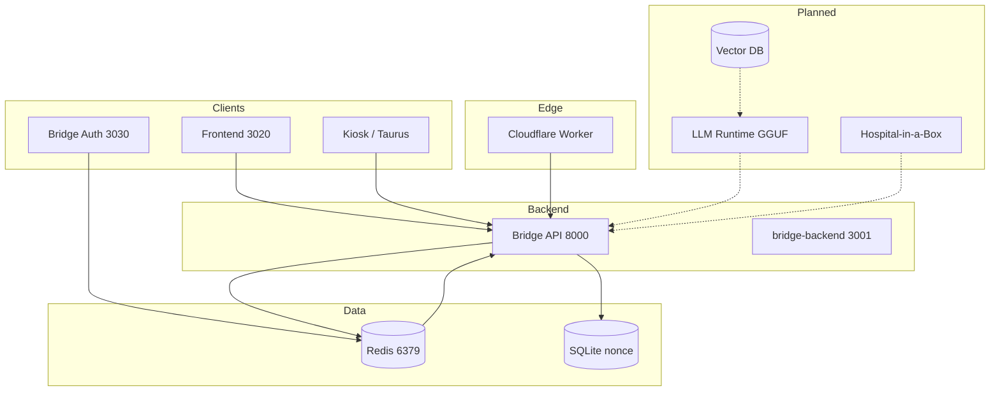

# Prompt for Bridge AI OS System Diagram

Use this prompt in draw.io, another diagram tool, or an AI diagram generator to produce a **Bridge AI OS** architecture diagram.

---

## Copy-paste prompt (for another system)

```
Create a system architecture diagram for "Bridge AI OS" — a decentralized AI orchestration platform.

**Top level (user-facing):**
- Web frontend (Vite, port 3020) — twin UI, mission board, founder TODO, marketplace, speech embodiment, system comprehension
- Dashboard (port 3000) — optional status view
- Kiosk / Taurus Showcase — thin clients that poll live report API
- Bridge Auth (port 3030) — SIWE wallet login, JWT, refresh tokens, WebSocket events

**Core backend:**
- Bridge API (Python/FastAPI, port 8000) — REST API, OpenAPI spec, all /api/* routes
- bridge-backend (Node, port 3001) — gateway / proxy
- Worker (Cloudflare) — api.bridge-ai-os.tech, edge logic

**Data layer:**
- Redis (port 6379) — primary: memory store, cortex state, contract events, auth sessions (working memory + event queue)
- SQLite — SIWE nonce only (replay protection)
- File fallback — when Redis unavailable (resilience)

**Orchestration / brain (current):**
- Cortex — capabilities flags, state version (Redis INCR), reducers
- Digital twins — profile, shared XML, decide/simulate/evolve endpoints
- Mission board, founder TODO, marketplace, UBI, revenue, SDG, bossbots
- Live map & report — GET /api/live/map, /api/live/report (single source of truth for status)
- Sensors — WiFi RF, mouse tracker → POST/GET /api/sensors/wifi, /api/sensors/mouse

**Optional / future (show as dashed or “planned”):**
- LLM runtime (GGUF + CUDA) — local models, twin reasoning
- Vector database — semantic memory, embeddings (Qdrant/Weaviate/Milvus)
- Hospital-in-a-Box — medical devices, IoT ingestion

**External:**
- Linea RPC / smart contracts (SIWE, on-chain role)
- Google Drive / MCP (sync, audit summary)
- Cloudflare R2 (storage)

**Flows to show:**
1. User → Frontend → Bridge API → Redis (state, memory)
2. Wallet → Bridge Auth (SIWE) → Redis (sessions) → JWT → API
3. Sensors → POST to API → Redis → live report
4. Worker ↔ API / Redis (edge ↔ core)
5. (Future) Vector DB ↔ LLM runtime ↔ Cortex / Twins

Style: clear boxes, labeled arrows, group “current” vs “planned” (e.g. colour or dashed). Title: Bridge AI OS — System Architecture.
```

---

## Shorter variant (minimal)

```
Diagram: Bridge AI OS. 
Frontend (3020) + Auth (3030) → Bridge API (8000) → Redis (6379) + SQLite (nonce). 
Worker (Cloudflare) + sensors (WiFi, mouse) feed API. 
Live map/report = single status source. 
Optional future: LLM runtime (GGUF), vector DB, Hospital-in-a-Box. 
Show data flows and “current” vs “planned” layers.
```

---

## For Mermaid (e.g. in docs or draw.io)



---

## Stored diagrams (draw.io)

- **docs/diagrams/** — Store `.drawio`, `.drawio.xml`, `.dio` here. **BRIDGE.DRAWIO** = canonical Bridge AI OS diagram (edit in VS Code Draw.io or app.diagrams.net; sync to [Google Drive](https://drive.google.com/drive) as needed). **Digital Ecosystem Evolution** = same four-layer + civilization flow; import from URL-encoded paste via `docs/diagrams/encoded_diagram.txt` and `.\scripts\import-drawio-from-encoded.ps1`. See **docs/diagrams/README.md**.
- **Four-layer self-expanding model:** **docs/SELF-EXPANDING-AI-NETWORK.md** (Infrastructure, Agents, Economy, Replication). **Global swarm:** **docs/GLOBAL-TWIN-SWARM-ARCHITECTURE.md** (node mesh, discovery, global tasks, replication engine).
- **sync-twins-wiki:** `.\scripts\sync-twins-wiki.ps1` — does not modify docs/diagrams/.

## References

- **Architecture:** docs/ARCHITECTURE.md, docs/SPINE.md  
- **Current vs target:** docs/REPO-STATE-AND-TARGET-ARCHITECTURE.md  
- **API list:** openapi.json, docs/CONTRACTS.md  
- **Scan:** docs/SCAN-CUDA-GGUF-DB-API.md  
