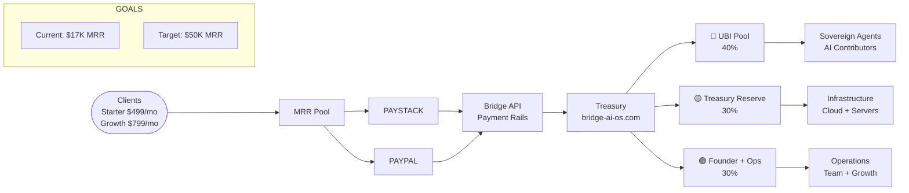
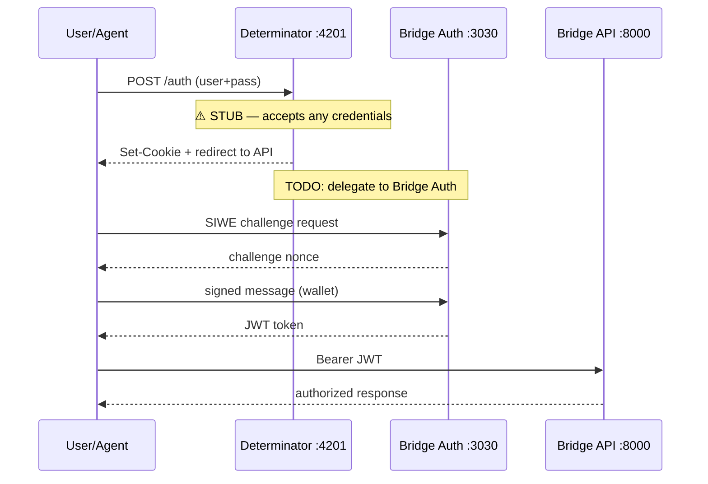

# Bridge AI OS v1.0 — Fully Annotated Architecture

*Generated: 2026-03-16 | Source: BridgeLiveWall Digital Twin Bootstrap*

---

## Control Plane Overview

```
┌─────────────────────────────────────────────────────────────────────────────┐
│                     BRIDGE AI OS — CONTROL PLANE                            │
│                     bridge-ai-os.com  |  api.bridge-ai-os.tech              │
└───────────────────────────────┬─────────────────────────────────────────────┘
                                 │
          ┌──────────────────────┼──────────────────────┐
          │                      │                       │
    ┌─────▼──────┐         ┌─────▼──────┐        ┌──────▼──────┐
    │ INFRA      │         │ SECURITY   │         │ FINANCIAL   │
    │ HEALTH     │         │ MONITORING │         │ ENGINE      │
    └─────┬──────┘         └─────┬──────┘         └──────┬──────┘
          │                      │                        │
    ┌─────▼──────┐         ┌─────▼──────┐        ┌──────▼──────┐
    │ AI SWARM   │         │ DIGITAL    │         │ TREASURY    │
    │ MISSION    │         │ TWIN LAYER │         │ + UBI POOL  │
    └────────────┘         └────────────┘         └─────────────┘
```

---

## Service Dependency Graph (Mermaid)

```mermaid
graph TB
    %% Entry Points
    USER([User / Agent]) --> GATEWAY[Gateway :3020/gateway]
    USER --> DETERMINATOR[Determinator RBAC\n:4201]
    USER --> FRONTEND[Digital Twin Frontend\n:3020]

    %% Auth Layer
    DETERMINATOR -->|RBAC login → redirect| BRIDGE_API
    DETERMINATOR -.->|TODO: delegate to| BRIDGE_AUTH[Bridge Auth\n:3030\nSIWE + JWT + Redis]

    %% Core API
    BRIDGE_API[Bridge API FastAPI\n:8000] --> REDIS[(Redis\n:6379\nSessions + Cache)]
    BRIDGE_API --> NEO4J[(Neo4j\n:7474/7687\nKnowledge Graph)]
    BRIDGE_API --> CORTEX[Cortex Agent Layer]

    %% Services Layer
    BRIDGE_API --> SVC_REV[Revenue Service]
    BRIDGE_API --> SVC_TREAS[Treasury Service]
    BRIDGE_API --> SVC_TWIN[Digital Twin Service]
    BRIDGE_API --> SVC_SWARM[Swarm Message Bus]
    BRIDGE_API --> SVC_EVOL[Evolution Governance]
    BRIDGE_API --> SVC_TELEM[Telemetry Service]
    BRIDGE_API --> SVC_KG[Knowledge Graph Service]
    BRIDGE_API --> SVC_MISSION[Mission Economy]
    BRIDGE_API --> SVC_PAYMENT[Payment Rails]

    %% Agent / Swarm Layer
    CORTEX --> AGENT_POOL[Agent Pool\nDigital Twins]
    CORTEX --> SWARM[Swarm Nodes\nSovereign Mesh]
    SVC_SWARM --> SWARM

    %% Financial Layer
    SVC_PAYMENT --> PAYSTACK[Paystack\n🔑 PAYSTACK_*]
    SVC_PAYMENT --> PAYPAL[PayPal\n🔑 PAYPAL_*]
    SVC_REV --> SVC_TREAS
    SVC_TREAS --> UBI[UBI Pool\n40% MRR]
    SVC_TREAS --> FOUNDER[Founder + Ops\n30% MRR]
    SVC_TREAS --> RESERVE[Treasury Reserve\n30% MRR]

    %% Monitoring Stack
    SVC_TELEM --> PROMETHEUS[Prometheus\n:9090]
    PROMETHEUS --> GRAFANA[Grafana\n:3001]
    PROMETHEUS -.->|⚠️ MISSING| ALERTS[alerts.yml\nNOT FOUND]

    %% Edge / Cloud
    WORKER[Cloudflare Worker\napi.bridge-ai-os.tech] --> BRIDGE_API
    VERCEL[Vercel\napp.supaco.ai] -.->|CF 1016 error| DNS_CF[Cloudflare DNS]

    %% External AI
    BRIDGE_API --> OPENROUTER[OpenRouter\n🔑 OPENROUTER_API_KEY]
    BRIDGE_API --> ANTHROPIC[Anthropic\n🔑 ANTHROPIC_API_KEY]

    %% Frontend
    FRONTEND --> BRIDGE_API
    FRONTEND --> BABYLON[BabylonJS 3D\nDigital Twin Renderer]
    TAURUS[Taurus Showcase\n:4202] --> BRIDGE_API

    %% CI/CD
    GH_ACTIONS[GitHub Actions\n.github/workflows/ci.yml] --> DOCKER[Docker Compose\n6 containers]
    DOCKER --> BRIDGE_API
    DOCKER --> FRONTEND
    DOCKER --> REDIS
    DOCKER --> NEO4J
    DOCKER --> PROMETHEUS
    DOCKER --> GRAFANA

    %% Style
    classDef critical fill:#7f1d1d,stroke:#ef4444,color:#fff
    classDef warning fill:#78350f,stroke:#f59e0b,color:#fff
    classDef ok fill:#14532d,stroke:#22c55e,color:#fff
    classDef external fill:#1e3a5f,stroke:#3b82f6,color:#fff
    classDef missing fill:#4c1d95,stroke:#8b5cf6,color:#fff,stroke-dasharray:5

    class DETERMINATOR critical
    class ALERTS missing
    class SVC_TREAS warning
    class BRIDGE_API,REDIS ok
    class PAYSTACK,PAYPAL,OPENROUTER,ANTHROPIC external
    class VERCEL warning
```



---

## Revenue Flow Diagram



---

## Authentication Flow



---

## Infrastructure Topology

```
┌─────────────────── CLOUDFLARE EDGE ─────────────────────┐
│  api.bridge-ai-os.tech → Worker → Bridge API :8000      │
│  bridge-ai-os.com → Primary domain                       │
│  supaco.ai → Auth + API (JWT)                            │
│  app.supaco.ai → Vercel ⚠️ (CF 1016 — CNAME missing)   │
└──────────────────────────────────────────────────────────┘
          │
          ▼
┌─────────────────── DOCKER COMPOSE ──────────────────────┐
│                                                          │
│  ┌──────────────┐  ┌──────────────┐  ┌───────────────┐ │
│  │ backend      │  │ frontend     │  │ redis         │ │
│  │ FastAPI:8000 │  │ Vite:3020    │  │ :6379         │ │
│  └──────┬───────┘  └──────┬───────┘  └───────┬───────┘ │
│         │                  │                  │         │
│  ┌──────▼───────┐  ┌──────▼───────┐  ┌───────▼───────┐ │
│  │ prometheus   │  │ grafana      │  │ neo4j         │ │
│  │ :9090        │  │ :3001        │  │ :7474/:7687   │ │
│  └──────────────┘  └──────────────┘  └───────────────┘ │
└──────────────────────────────────────────────────────────┘
          │
          ▼
┌─────────────────── LOCAL SERVICES ──────────────────────┐
│  Determinator :4201  │  Taurus :4202  │  Bridge Auth :3030 │
└──────────────────────────────────────────────────────────┘
```

---

## Security Gap Map

| Gap | Severity | Location | Fix |
|-----|----------|----------|-----|
| RBAC stub — accepts any login | 🔴 CRITICAL | `scripts/determinator-boot-agent.js:60` | Add env-var auth or delegate to bridge-auth JWT |
| Hardcoded Neo4j password `bridge123` | 🔴 CRITICAL | `docker-compose.yml:68` | ✅ Fixed → `${NEO4J_PASSWORD}` |
| Hardcoded Grafana password `admin` | 🔴 CRITICAL | `docker-compose.yml:53` | ✅ Fixed → `${GRAFANA_ADMIN_PASSWORD}` |
| PayPal webhook verification is `pass` | 🟠 HIGH | `backend/app/services/payment_rails.py` | Implement HMAC signature check |
| `alerts.yml` missing | 🟡 MEDIUM | `prometheus.yml:18` | Create minimal alerts.yml |
| Revenue/treasury state is in-memory | 🟡 MEDIUM | All treasury services | Persist to Redis or SQLite |
| `prometheus_client` not in requirements | 🟡 MEDIUM | `backend/requirements.txt` | ✅ Fixed → added `prometheus_client>=0.19.0` |
| Console sync :3022 — no server code | 🟢 LOW | Port map only | Implement or remove from registry |

---

## Module Registry

| Module | Path | Language | Purpose |
|--------|------|----------|---------|
| Bridge API | `backend/app/` | Python/FastAPI | Core API, routing, services |
| Digital Twin Frontend | `frontend/` | JS/Vite/BabylonJS | 3D twin UI, gateway, join |
| Determinator Boot Agent | `scripts/determinator-boot-agent.js` | Node.js | RBAC entry, system map |
| Bridge Auth | `bridge-auth/` | Node.js | SIWE, JWT, Redis sessions |
| Bridge Backend | `bridge-backend/` | Node.js | Sovereign entry ladder |
| Taurus Showcase | `config → port 4202` | — | Gamification showcase |
| Cloudflare Worker | `worker/` | JS/Wrangler | Edge API proxy |
| Bridge DeFi Frontend | `bridge_defi/frontend/` | JS | DeFi interface |
| Revenue Service | `backend/app/services/revenue.py` | Python | MRR tracking, splits |
| Treasury Service | `backend/app/services/mission_economy.py` | Python | UBI/treasury distribution |
| Swarm Message Bus | `backend/app/services/swarm_message_bus.py` | Python | Agent coordination |
| Knowledge Graph | `backend/app/services/knowledge_graph.py` | Python | Neo4j integration |
| Evolution Governance | `backend/app/services/evolution_governance.py` | Python | Agent lifecycle |
| Payment Rails | `backend/app/services/payment_rails.py` | Python | Paystack + PayPal |
| Telemetry | `backend/app/services/telemetry.py` | Python | Prometheus metrics |

---

## Environment Variables Required

```bash
# Infrastructure secrets (move from docker-compose hardcodes)
NEO4J_PASSWORD=                    # was bridge123
GRAFANA_ADMIN_PASSWORD=            # was admin

# Auth
JWT_SECRET=
BRIDGE_SIWE_JWT_SECRET=
DETERMINATOR_USER=                 # Determinator RBAC login
DETERMINATOR_PASS=                 # Determinator RBAC password

# Payments
PAYSTACK_SECRET_KEY=
PAYSTACK_PUBLIC_KEY=
PAYPAL_CLIENT_ID=
PAYPAL_CLIENT_SECRET=

# AI
OPENROUTER_API_KEY=
ANTHROPIC_API_KEY=
ELEVEN_API_KEY=

# Email
RESEND_API_KEY=

# Services
REDIS_URL=redis://localhost:6379/0
NEO4J_URI=bolt://localhost:7687
```
